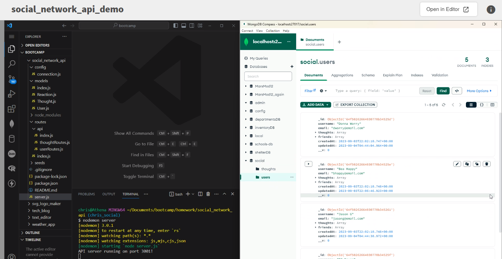
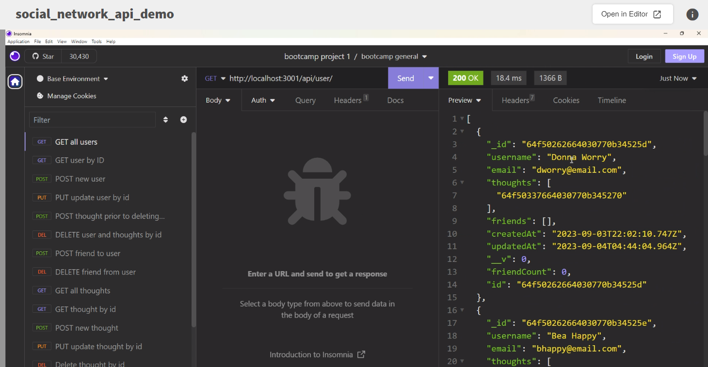

  # Social Network API

  ## Description
  
The Social Network API is an application interface for a social network web app where users can share their thoughts,  react to other's thoughts, and create a friend list.  The tech stack for this api will include Express.js, Mongoose, and a MongoDB database.  

  ## Table of Contents
  [Installation Instructions](#installation-instructions) 
  [Usage](#usage) 
  [License](#license) 
  [Contributors](#contributors) 
  [Tests](#tests) 
  [Questions](#questions) 
  [References](#references) 

  
  ## Installation Instructions
  
    To install the required packages to run this app locally, navigate to the root directory of the project and open an integrated terminal.  Type <strong> npm i -y</strong> in the terminal and enter.  This will install the packages listed in the package manager. 
  
  ## Usage
  
    To run the app locally, type node server.js in the terminal and enter. Insomnia can be used to evaluate the functionality of the api routes. 

  Watch a demo of the app here:
  <https://watch.screencastify.com/v/33orm39VMzw9EI1Pt3wy>

  

  

  ## License
    none

  ## Contributors
  ChristyGruen at <https://github.com/ChristyGruen>
      
  #### How to Contribute
    To contribute to the app: fork the repo on GitHub, then clone the project to your own machine.  Update the code, commit your changes to your own branch, then push your work to your fork on GitHub. Finally, submit a Pull request for review.

  ## Tests
    none

  ## Questions
  For further information, access my gitHub profile here:
  <https://github.com/ChristyGruen>
   
  For questions, comments and concerns, please log an issue at: 
  <https://github.com/ChristyGruen/social_network_api/issues>

  ## References
  References used during the api build are listed in the individual files where they were referenced.
  